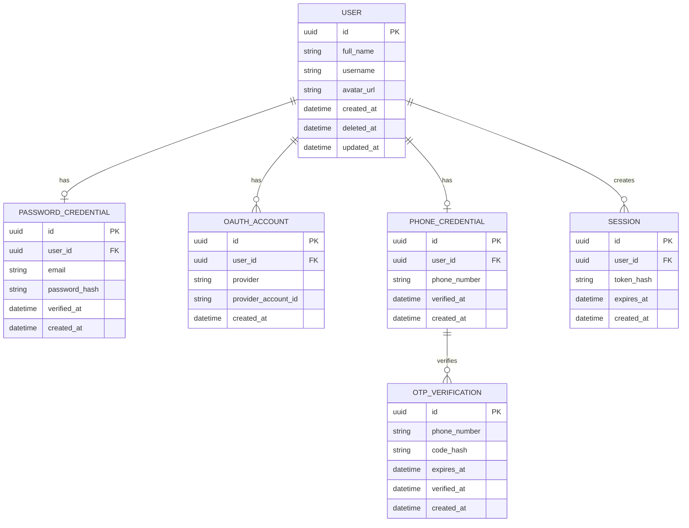

# Entity Relationship Diagram

```mermaid
erDiagram

    USER {
        uuid id PK
        string full_name
        string username
        string avatar_url
        datetime created_at
        datetime deleted_at
        datetime updated_at
    }

    PASSWORD_CREDENTIAL {
        uuid id PK
        uuid user_id FK
        string email
        string password_hash
        datetime verified_at
        datetime created_at
    }

    OAUTH_ACCOUNT {
        uuid id PK
        uuid user_id FK
        string provider
        string provider_account_id
        datetime created_at
    }

    PHONE_CREDENTIAL {
        uuid id PK
        uuid user_id FK
        string phone_number
        datetime verified_at
        datetime created_at
    }

    OTP_VERIFICATION {
        uuid id PK
        string phone_number
        string code_hash
        datetime expires_at
        datetime verified_at
        datetime created_at
    }

    SESSION {
        uuid id PK
        uuid user_id FK
        string token_hash
        datetime expires_at
        datetime created_at
    }

    USER ||--o| PASSWORD_CREDENTIAL : has
    USER ||--o{ OAUTH_ACCOUNT : has
    USER ||--o| PHONE_CREDENTIAL : has
    USER ||--o{ SESSION : creates

    PHONE_CREDENTIAL ||--o{ OTP_VERIFICATION : verifies
```