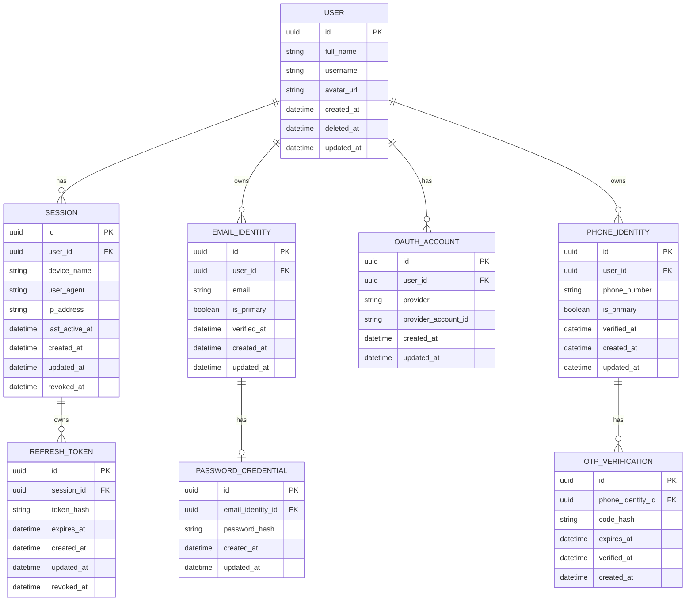

# Entity Relationship Diagram

```mermaid
erDiagram

    USER {
        uuid id PK
        string full_name
        string username
        string avatar_url
        datetime created_at
        datetime deleted_at
        datetime updated_at
    }

    EMAIL_IDENTITY {
        uuid id PK
        uuid user_id FK
        string email
        boolean is_primary
        datetime verified_at
        datetime created_at
        datetime updated_at
    }

    PHONE_IDENTITY {
        uuid id PK
        uuid user_id FK
        string phone_number
        boolean is_primary
        datetime verified_at
        datetime created_at
        datetime updated_at
    }

    PASSWORD_CREDENTIAL {
        uuid id PK
        uuid email_identity_id FK
        string password_hash
        datetime created_at
        datetime updated_at
    }

    OAUTH_ACCOUNT {
        uuid id PK
        uuid user_id FK
        string provider
        string provider_account_id
        datetime created_at
        datetime updated_at
    }

    OTP_VERIFICATION {
        uuid id PK
        uuid phone_identity_id FK
        string code_hash
        datetime expires_at
        datetime verified_at
        datetime created_at
    }

    SESSION {
        uuid id PK
        uuid user_id FK
        string device_name
        string user_agent
        string ip_address
        datetime last_active_at
        datetime created_at
        datetime updated_at
        datetime revoked_at
    }

    REFRESH_TOKEN {
        uuid id PK
        uuid session_id FK
        string token_hash
        datetime expires_at
        datetime created_at
        datetime updated_at
        datetime revoked_at
    }

    USER ||--o{ OAUTH_ACCOUNT : has
    USER ||--o{ SESSION : has
    SESSION ||--o{ REFRESH_TOKEN : owns

    USER ||--o{ EMAIL_IDENTITY : owns
    USER ||--o{ PHONE_IDENTITY : owns

    EMAIL_IDENTITY ||--o| PASSWORD_CREDENTIAL : has

    PHONE_IDENTITY ||--o{ OTP_VERIFICATION : has
```
